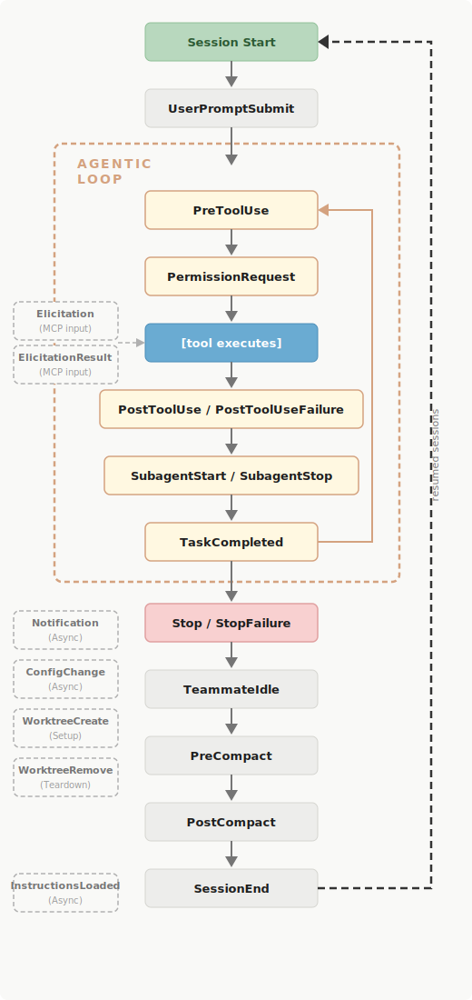

# Claude Hooks 系统
> `/hooks` 以打开交互式 hooks 管理器
## 概念

Hooks 是用户定义的 shell 命令，在 Claude Code 生命周期中的特定点执行，提供确定性控制。

**用途**：强制执行项目规则、自动化重复任务、与现有工具集成。

---

## 配置位置

| 位置 | 范围 |
|------|------|
| `~/.claude/settings.json` | 所有项目（全局） |
| `.claude/settings.json` | 当前项目（可共享） |
| `.claude/settings.local.json` | 当前项目（本地，不共享） |

---

## 生命周期
> Hooks 在 Claude Code 会话期间的特定点触发。当事件触发且匹配器匹配时，Claude Code 会将关于该事件的 JSON 上下文传递给您的 hook 处理程序。
>
> - 命令 hooks，输入通过 stdin 到达
> - HTTP hooks，它作为 POST 请求体到达




| Event | 触发时机 |
|-------|---------|
| `SessionStart` | 会话开始或恢复时 |
| `UserPromptSubmit` | 当你提交提示时，在 Claude 处理之前 |
| `PreToolUse` | 在工具调用执行之前。可以屏蔽它 |
| `PermissionRequest` | 当出现许可对话框时 |
| `PostToolUse` | 工具调用成功后 |
| `PostToolUseFailure` | 工具调用失败后 |
| `Notification` | 当 Claude Code 发送通知时 |
| `SubagentStart` | 当子代理生成时 |
| `SubagentStop` | 当一个分代理结束时 |
| `Stop` | 克劳德回应完毕 |
| `StopFailure` | 当回合因 API 错误而结束时。输出和退出代码被忽略 |
| `TeammateIdle` | 当 agent team 即将进入空闲状态时 |
| `TaskCompleted` | 当任务被标记为已完成时 |
| `InstructionsLoaded` | 当 CLAUDE.md 或 .claude/rules/*.md 文件加载到上下文中时，在会话开始时和文件加载懒散时都会触发 |
| `ConfigChange` | 当会话中配置文件发生变化时 |
| `WorktreeCreate` | 当工作树是通过 --worktree 或隔离（"worktree"） 创建时，替换默认的 git 行为 |
| `WorktreeRemove` | 当工作树被移除时，无论是在会话结束时还是子代理完成时 |
| `PreCompact` | 上下文压缩之前 |
| `PostCompact` | 上下文压缩完成后 |
| `Elicitation` | 当 MCP 服务器在工具调用时请求用户输入 |
| `ElicitationResult` | 用户响应 MCP 引发后，响应返回服务器之前 |
| `SessionEnd` | 会话终止时 |

---

## `matcher`匹配器模式
> matcher 字段是一个正则表达式字符串，用于过滤 hooks 何时触发。
> 使用 "*"、"" 或完全省略 matcher 来匹配所有出现。

- 匹配器针对 Claude Code 在 stdin 上发送给您的 hook 的 JSON 输入 中的字段运行。
- 对于工具事件，该字段是 `tool_name`。

按事件类型过滤触发条件：

| 事件 | 匹配器过滤的内容 | 示例匹配器值 |
|------|------------------|----------------|
| `PreToolUse`、`PostToolUse`、`PostToolUseFailure`、 <br> `PermissionRequest` | 工具名称 | `Bash`、`Edit\|Write`、`mcp__.*` |
| `SessionStart` | 会话如何启动 | `startup`、`resume`、`clear`、`compact` |
| `SessionEnd` | 会话为何结束 | `clear`、`logout`、`prompt_input_exit`、<br> `bypass_permissions_disabled`、`other` |
| `Notification` | 通知类型 | `permission_prompt`、`idle_prompt`、 <br> `auth_success`、`elicitation_dialog` |
| `SubagentStart` | 代理类型 | `Bash`、`Explore`、`Plan` 或自定义代理名称 |
| `PreCompact` | 触发压缩的原因 | `manual`、`auto` |
| `SubagentStop` | 代理类型 | 与 `SubagentStart` 相同的值 |
| `ConfigChange` | 配置源 | `user_settings`、`project_settings`、 <br> `local_settings`、`policy_settings`、`skills` |
| `UserPromptSubmit`、`Stop`、`TeammateIdle`、 <br> `TaskCompleted`、`WorktreeCreate`、`WorktreeRemove`、 <br> `InstructionsLoaded` | 不支持匹配器 | — |

### 匹配 MCP 工具

MCP 服务器工具在工具事件中显示为常规工具（PreToolUse、PostToolUse、PostToolUseFailure、PermissionRequest），因此您可以像匹配任何其他工具名称一样匹配它们。

> MCP 工具遵循命名模式 `mcp__<server>__<tool>`
---

## Hook 类型

| type | 说明 | 输入 | 输出 |
|------|------|------|------|
| `command` | 运行 shell 脚本（最常用） | stdin JSON | 退出代码 + stdout |
| `prompt` | 单轮 LLM 评估，适合 yes/no 判断 | 事件 JSON + 提示词 | JSON 决定 |
| `agent` | 多轮验证，可访问文件和工具 | 事件上下文 | Read/Grep/Glob 后决定 |
| `http` | POST 事件到外部端点 | HTTP POST 请求体 | JSON 响应体 |

### 事件类型支持

**支持全部四种类型**（`command`、`http`、`prompt`、`agent`）：

| Event | 触发时机 |
|-------|---------|
| PermissionRequest | 当出现许可对话框时 |
| PostToolUse | 工具调用成功后 |
| PostToolUseFailure | 工具调用失败后 |
| PreToolUse | 在工具调用执行之前。可以屏蔽它 |
| Stop | 克劳德回应完毕 |
| SubagentStop | 当一个分代理结束时 |
| TaskCompleted | 当任务被标记为已完成时 |
| UserPromptSubmit | 当你提交提示时，在 Claude 处理之前 |

**仅支持 `type: "command"` hooks**：

| Event | 触发时机 |
|-------|---------|
| ConfigChange | 当会话中配置文件发生变化时 |
| InstructionsLoaded | 当 CLAUDE.md 或 .claude/rules/*.md 文件加载到上下文中时 |
| Notification | 当 Claude Code 发送通知时 |
| PreCompact | 上下文压缩之前 |
| SessionEnd | 会话终止时 |
| SessionStart | 会话开始或恢复时 |
| SubagentStart | 当子代理生成时 |
| TeammateIdle | 当 agent team 即将进入空闲状态时 |
| WorktreeCreate | 当工作树是通过 --worktree 或隔离（"worktree"） 创建时 |
| WorktreeRemove | 当工作树被移除时，无论是在会话结束时还是子代理完成时 |

### Hook 处理程序字段

#### 通用字段

这些字段适用于所有 hook 类型：

| 字段 | 必需 | 描述 |
|------|:----:|------|
| `type` | 是 | `"command"`、`"http"`、`"prompt"` 或 `"agent"` |
| `timeout` | 否 | 超时秒数。默认：命令 600，提示 30，代理 60 |
| `statusMessage` | 否 | hook 运行时显示的自定义加载消息 |
| `once` | 否 | 每会话仅运行一次，然后移除（仅限 Skills，非代理） |

#### HTTP hook 字段

除了 通用字段 外，HTTP hooks 还接受这些字段：

| 字段 | 必需 | 描述 |
|------|:----:|------|
| `url` | 是 | 发送 POST 请求的 URL |
| `headers` | 否 | HTTP 标头键值对。值支持 `$VAR_NAME` 或 `${VAR_NAME}` 环境变量插值, 仅解析 allowedEnvVars 中列出的变量 |
| `allowedEnvVars` | 否 | 允许插值的环境变量名列表（未列出者替换为空） |

#### Prompt 和 Agent hook 字段

除了 通用字段 外，提示和代理 hooks 还接受这些字段：

| 字段 | 必需 | 描述 |
|------|:----:|------|
| `prompt` | 是 | 发送给模型的提示文本。使用 `$ARGUMENTS` 作为 hook 输入 JSON 的占位符 |
| `model` | 否 | 评估使用的模型（默认：快速模型） |

---

## 路径引用

- `$CLAUDE_PROJECT_DIR`：项目根目录。用引号包装以处理包含空格的路径。
- `${CLAUDE_PLUGIN_ROOT}`：插件的根目录，用于与 plugin 捆绑的脚本。
>插件配置支持可选的顶级 `description` 字段，启用时自动合并到现有 hooks

---

## Hook 通信

**输入**：
- 命令 Hooks 通过 **stdin、stdout、stderr** 和退出代码与 Claude Code 通信。
- HTTP hooks 接收相同的 JSON 作为 POST 请求体，并通过 HTTP 响应体传回结果。

**输出**：脚本通过写入 **stdout 或 stderr** 并以特定代码退出来告诉 Claude Code 接下来要做什么。

### 通用输入字段
- 所有 hook 事件都接收这些字段作为 JSON，除了每个 hook 事件 部分中记录的事件特定字段。
- 对于命令 hooks，此 JSON 通过 stdin 到达。对于 HTTP hooks，它作为 POST 请求体到达。

所有 hook 事件都接收这些字段作为 JSON：

| 字段 | 描述 |
|------|------|
| `session_id` | 当前会话标识符 |
| `transcript_path` | 对话 JSON 的路径 |
| `cwd` | 调用 hook 时的当前工作目录 |
| `permission_mode` | 当前权限模式：`"default"`/`"plan"`/`"acceptEdits"`/`"dontAsk"`/`"bypassPermissions"` |
| `hook_event_name` | 触发的事件名称 |

使用 `--agent` 运行或在 subagent 内部时，包括两个额外字段：

| 字段 | 描述 |
|------|------|
| `agent_id` | subagent 的唯一标识符。仅当 hook 在 subagent 调用内触发时存在 |
| `agent_type` | 代理名称（如 `"Explore"` 或 `"security-reviewer"`）。对于 subagents，subagent 类型优先于 `--agent` 值 |

### 结构化JSON输出
> 使用 `exit 2` 通过 `stderr` 消息阻止，或使用 `exit 0` 和 JSON 进行结构化控制。不要混合它们：`Claude Code` 在你以 `exit 2` 退出时忽略 JSON。

### 退出代码输出

| 退出代码 | 行为 |
|---------|------|
| `0` | 解析 stdout 以获取 JSON 输出字段 |
| `2` | 忽略 stdout 和其中的任何 JSON（通过`>&2`写入 `stderr` 原因反馈给 Claude） |
| `任何其他退出代码` | 操作继续，stderr 仅记录,不显示给 Claude |

#### 退出代码 2 行为
> 退出代码 2 是 hook 发出”停止，不要这样做”的方式。效果取决于事件。

| Hook 事件 | 可阻止？ | 退出 2 时的行为 |
|-----------|:--------:|----------------|
| `PreToolUse` | ✓ | 阻止工具调用 |
| `PermissionRequest` | ✓ | 拒绝权限 |
| `UserPromptSubmit` | ✓ | 阻止提示处理并从上下文中删除 |
| `Stop` | ✓ | 防止 Claude 停止，继续对话 |
| `SubagentStop` | ✓ | 防止 subagent 停止 |
| `TeammateIdle` | ✓ | 防止队友空闲（继续工作） |
| `TaskCompleted` | ✓ | 防止任务被标记为已完成 |
| `ConfigChange` | ✓ | 阻止配置更改生效（除 `policy_settings` 外） |
| `PostToolUse` | ✗ | 向 Claude 显示 stderr（工具已运行） |
| `PostToolUseFailure` | ✗ | 向 Claude 显示 stderr（工具已失败） |
| `Notification` | ✗ | 仅向用户显示 stderr |
| `SubagentStart` | ✗ | 仅向用户显示 stderr |
| `SessionStart` | ✗ | 仅向用户显示 stderr |
| `SessionEnd` | ✗ | 仅向用户显示 stderr |
| `PreCompact` | ✗ | 仅向用户显示 stderr |
| `WorktreeCreate` | ✓ | 任何非零退出代码都会导致失败 |
| `WorktreeRemove` | ✗ | 失败仅在调试模式下记录 |
| `InstructionsLoaded` | ✗ | 退出代码被忽略 |

### HTTP响应处理

HTTP hooks 使用 HTTP 状态代码和响应体而不是退出代码和 stdout：

- 2xx 带空体：成功，等同于退出代码 0 且无输出
- 2xx 带纯文本体：成功，文本作为上下文添加
- 2xx 带 JSON 体：成功，使用与命令 hooks 相同的 JSON 输出 架构解析
- 非 2xx 状态：非阻止错误，执行继续
- 连接失败或超时：非阻止错误，执行继续

与命令 hooks 不同，HTTP hooks 无法仅通过状态代码发出阻止错误信号。要阻止工具调用或拒绝权限，返回 2xx 响应，其 JSON 体包含适当的决定字段。

---

## Skills 和 Subagents 中的 Hooks
> hooks 可以使用 frontmatter 直接在 skills 和 subagents 中定义。
>
> 支持所有 hook 事件。**对于 subagents，Stop hooks 会自动转换为 SubagentStop**。
>
> Hooks 使用与基于设置的 hooks 相同的配置格式，但**范围限于组件的生命周期，并在其完成时清理**。

### 示例格式

```markdown
---
name: secure-operations
description: Perform operations with security checks
hooks:
  PreToolUse:
    - matcher: "Bash"
      hooks:
        - type: command
          command: "./scripts/security-check.sh"
---
```

---

## 限制

- 默认超时 10 分钟（可通过 `timeout` 字段配置）
- `PostToolUse` 无法撤销已执行的操作
- `PermissionRequest` 在非交互模式（`-p`）中不触发
- 命令 hooks 无法直接触发工具调用

---

## 故障排除

| 问题 | 解决方案 |
|------|---------|
| Hook 未触发 | 检查匹配器大小写、验证事件类型、确认配置位置 |
| 脚本报错 | 使用绝对路径、安装 `jq`、设置可执行权限 |
| JSON 解析失败 | 确保 shell 配置中的 echo 仅在交互模式下执行 |
| Stop 死循环 | 检查 `stop_hook_active` 字段，避免重复触发 |
