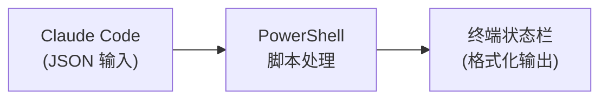

# Claude Code 状态栏配置完整教程

## 1. 状态栏配置概述

Claude Code 的状态栏（Status Line）是显示在界面底部的自定义信息区域。通过配置 PowerShell 脚本，您可以实时显示：

- 当前使用的 AI 模型
- Git 分支信息
- 上下文窗口使用情况
- AI 活动追踪（正在运行的工具）
- 子代理状态

### 配置文件位置

```
Windows: C:\Users\<用户名>\.claude\
├── settings.json          # 主配置文件
├── statusline.ps1         # 状态栏脚本
└── statusline-debug.json  # 调试输出（可选）
```

### 工作原理



1. Claude Code 将当前状态信息以 JSON 格式传递给脚本
2. PowerShell 脚本解析 JSON 并提取需要的信息
3. 脚本将格式化后的文本输出到状态栏

---

## 2. 基础配置

### 2.1 settings.json 配置

在 `C:\Users\<用户名>\.claude\settings.json` 中添加以下配置：

```json
{
  "statusLine": {
    "type": "command",
    "command": "powershell -NoProfile -ExecutionPolicy Bypass -File \"C:\\Users\\<用户名>\\.claude\\statusline.ps1\""
  }
}
```

**配置说明：**

| 参数 | 说明 |
|------|------|
| `type: "command"` | 使用命令方式执行脚本 |
| `-NoProfile` | 不加载 PowerShell 配置文件，加快启动速度 |
| `-ExecutionPolicy Bypass` | 绕过执行策略限制 |
| `-File` | 指定要执行的脚本文件 |

### 2.2 JSON 输入数据结构

Claude Code 会将以下 JSON 数据传递给脚本：

```json
{
  "model": {
    "display_name": "Claude Opus 4.6",
    "model_id": "claude-opus-4-6",
    "provider": "anthropic"
  },
  "context_window": {
    "used_percentage": 15,
    "remaining_percentage": 85,
    "current_usage": 30000,
    "max_tokens": 200000
  },
  "workspace": {
    "current_dir": "E:\\code\\Obsidian_Note",
    "project_name": "Obsidian_Note"
  },
  "session": {
    "id": "session-id-123",
    "cost": 0.05
  }
}
```

**常用字段说明：**

| 字段路径 | 说明 | 示例值 |
|---------|------|--------|
| `model.display_name` | 模型显示名称 | `Claude Opus 4.6` |
| `context_window.used_percentage` | 上下文已使用百分比 | `15` |
| `workspace.current_dir` | 当前工作目录 | `E:\code\project` |
| `session.cost` | 当前会话成本 | `0.05` |

---

## 3. 三行状态栏设计思路

三行状态栏的设计目标是将不同类型的信息分层展示，让用户一目了然：

```
┌─────────────────────────────────────────────────────────────┐
│  第一行：基础状态    │  模型 + Git分支 + 上下文% + 工作目录  │
├─────────────────────────────────────────────────────────────┤
│  第二行：活动历史    │  最近5次工具调用的时间线流            │
├─────────────────────────────────────────────────────────────┤
│  第三行：代理状态    │  当前运行的子代理类型和状态           │
└─────────────────────────────────────────────────────────────┘
```

### 第一行：基础状态
显示最核心的信息，包括当前使用的 AI 模型、所在 Git 分支、上下文窗口的使用百分比，以及当前工作目录（路径过长时会自动缩短）。这些信息在会话过程中相对稳定，适合放在顶部。

### 第二行：活动历史
显示最近 5 次工具调用的时间线流，格式为 `R:file > G:pattern > E:file > B > T`。各符号含义：
- `R:文件名` - Read 工具
- `G:搜索内容` - Grep 工具
- `E:文件名` - Edit 工具
- `B` - Bash 工具
- `T` - Task 工具

当没有活动时显示 `Idle`，有后台任务时附加 `| Task*N`。

### 第三行：代理状态
显示当前是否有子代理在运行。脚本会通过三种方式检测：
1. 输入 JSON 中的 `active_agent` / `current_agent` 字段
2. 从 transcript 文件中解析最近的代理活动
3. 检查临时任务目录中最近修改的文件

---

## 4. 完整实现代码

将以下代码保存为 `statusline.ps1`：

```powershell
# Claude Code Status Line Script
# Three-line status bar with model info, git branch, context usage, AI activity tracking, and agent status

# Set encoding to prevent encoding issues (especially for non-ASCII characters)
# Status line: Model | Git | Context | Activity | Agent
[Console]::InputEncoding = [System.Text.Encoding]::UTF8
[Console]::OutputEncoding = [System.Text.Encoding]::UTF8

try {
    # Read JSON input from stdin - more stable than $input automatic variable
    $inputJson = [Console]::In.ReadToEnd()

    # Ensure debug directory exists
    $debugDir = Join-Path $env:USERPROFILE ".claude"
    if (-not (Test-Path $debugDir)) {
        New-Item -ItemType Directory -Path $debugDir -Force | Out-Null
    }
    $debugPath = Join-Path $debugDir "statusline-debug.json"

    # Save to debug file for analysis (only if we have data)
    if (-not [string]::IsNullOrWhiteSpace($inputJson)) {
        $inputJson | Out-File -FilePath $debugPath -Encoding UTF8
    }

    # Empty input - show default status
    if ([string]::IsNullOrWhiteSpace($inputJson)) {
        Write-Output "Claude Code - Ready"
        Write-Output "Idle"
        Write-Output "Agent: None | Idle"
        exit 0
    }

    $data = $inputJson | ConvertFrom-Json -ErrorAction Stop

    # ========== LINE 1: Basic Status (Model | Git Branch | Context % | Directory) ==========
    $parts = @()

    # Model name
    if ($data.model -and $data.model.display_name) {
        $parts += $data.model.display_name
    }

    # Git branch - with improved error handling
    $currentDir = if ($data.workspace) { $data.workspace.current_dir } else { $null }
    if ($currentDir) {
        try {
            $branch = git -C $currentDir --no-optional-locks branch --show-current 2>$null
            if (-not [string]::IsNullOrWhiteSpace($branch)) {
                $parts += "branch:$branch"
            }
        } catch {
            # Silently ignore git errors
        }
    }

    # Context usage
    if ($data.context_window -and $null -ne $data.context_window.used_percentage) {
        $parts += "ctx:$($data.context_window.used_percentage)%"
    }

    # Current directory (shortened)
    if ($currentDir) {
        $dirDisplay = $currentDir
        # Replace user profile path with ~
        $userProfile = $env:USERPROFILE
        if ($dirDisplay -like "$userProfile*") {
            $dirDisplay = $dirDisplay -replace [regex]::Escape($userProfile), "~"
        }
        # Show only last 2 directories if path is too long
        if ($dirDisplay.Length -gt 30) {
            $dirParts = $dirDisplay -split [regex]::Escape([IO.Path]::DirectorySeparatorChar)
            if ($dirParts.Count -gt 2) {
                $dirDisplay = "...\" + ($dirParts[-2..-1] -join '\')
            }
        }
        $parts += "dir:$dirDisplay"
    }

    $line1 = if ($parts.Count -gt 0) { $parts -join ' | ' } else { "Claude Code" }

    # ========== LINE 2: Recent Activity History ==========
    $recentActivities = @()
    $lastEditFile = "-"

    # Get recent activities from transcript (check last 20 entries for recent history)
    if ($data.transcript_path -and (Test-Path $data.transcript_path)) {
        try {
            $recentEntries = Get-Content $data.transcript_path -Tail 20 -ErrorAction SilentlyContinue
            # Process in reverse order (newest first)
            for ($i = $recentEntries.Count - 1; $i -ge 0; $i--) {
                $entry = $recentEntries[$i]
                try {
                    $entryData = $entry | ConvertFrom-Json -ErrorAction SilentlyContinue
                    if ($entryData.message -and $entryData.message.content) {
                        foreach ($contentItem in $entryData.message.content) {
                            if ($contentItem.type -eq "tool_use") {
                                $toolName = $contentItem.name
                                $toolInput = $contentItem.input
                                $activityText = ""

                                switch ($toolName) {
                                    "Read" {
                                        $file = Split-Path -Leaf $toolInput.file_path
                                        $activityText = "R:$file"
                                    }
                                    "Grep" {
                                        $pattern = $toolInput.pattern
                                        if ($pattern.Length -gt 15) { $pattern = $pattern.Substring(0, 15) + ".." }
                                        $activityText = "G:$pattern"
                                    }
                                    "Bash" {
                                        $activityText = "B"
                                    }
                                    "Edit" {
                                        $file = Split-Path -Leaf $toolInput.file_path
                                        $activityText = "E:$file"
                                        $lastEditFile = $file
                                    }
                                    "Task" {
                                        $activityText = "T"
                                    }
                                }

                                if ($activityText -and $recentActivities.Count -lt 5) {
                                    $recentActivities += $activityText
                                }
                            }
                        }
                    }
                } catch { }
                # Stop if we have enough activities
                if ($recentActivities.Count -ge 5) { break }
            }
        } catch { }
    }

    # Build line 2 from recent activities
    if ($recentActivities.Count -eq 0) {
        $line2 = "Idle"
    } else {
        $line2 = ($recentActivities | Select-Object -First 5) -join " > "
    }

    # Check for background tasks (append to line 2 if any)
    $taskCount = 0
    try {
        $tasksDir = Join-Path $env:USERPROFILE ".claude\tasks"
        if (Test-Path $tasksDir) {
            $runningTasks = Get-ChildItem $tasksDir -File -ErrorAction SilentlyContinue | Where-Object {
                try {
                    $content = Get-Content $_.FullName -Raw -ErrorAction SilentlyContinue
                    $content -match '"status"\s*:\s*"in_progress"' -or $content -match '"in_progress"'
                } catch {
                    $false
                }
            } | Measure-Object
            $taskCount = $runningTasks.Count
        }
    } catch {
        # Silently ignore tasks directory errors
    }

    # Append task count if running
    if ($taskCount -gt 0) {
        $line2 += " | Task*$taskCount"
    }

    # ========== LINE 3: Agent Status ==========
    $agentName = "None"
    $agentStatus = "Idle"
    $runningAgents = @()

    # First, check for active agent in input JSON
    if ($data.active_agent) {
        $agentName = if ($data.active_agent.name) { $data.active_agent.name } else { "Running" }
        $agentStatus = if ($data.active_agent.status) { $data.active_agent.status } else { "Active" }
    } elseif ($data.current_agent) {
        $agentName = $data.current_agent
        $agentStatus = "Running"
    } elseif ($data.agent -and $data.agent.name) {
        $agentName = $data.agent.name
        $agentStatus = "Active"
    }

    # If no agent info in input, check transcript for running agents
    if ($agentName -eq "None" -and $data.transcript_path -and (Test-Path $data.transcript_path)) {
        try {
            # Get recent entries from transcript
            $recentEntries = Get-Content $data.transcript_path -Tail 50 -ErrorAction SilentlyContinue
            $currentAgentId = $null
            $currentAgentSlug = $null

            # Check recent entries for agent activity (in reverse order - newest first)
            for ($i = $recentEntries.Count - 1; $i -ge 0; $i--) {
                $entry = $recentEntries[$i]
                try {
                    $entryData = $entry | ConvertFrom-Json -ErrorAction SilentlyContinue

                    # Check if this entry has an agentId (indicates sub-agent activity)
                    if ($entryData.agentId) {
                        $currentAgentId = $entryData.agentId
                        $currentAgentSlug = if ($entryData.slug) { $entryData.slug } else { $null }

                        # Try to get agent type from the message content
                        if ($entryData.message -and $entryData.message.content) {
                            foreach ($contentItem in $entryData.message.content) {
                                if ($contentItem.type -eq "tool_use" -and $contentItem.name -eq "Task") {
                                    $agentType = $contentItem.input.subagent_type
                                    if ($agentType) {
                                        $runningAgents += $agentType
                                    }
                                }
                            }
                        }

                        # Found agent activity, no need to check further for this round
                        break
                    }
                } catch { }
            }

            # Check if we found any running agents
            if ($runningAgents.Count -gt 0) {
                $agentName = $runningAgents[0]
                $agentStatus = "Running"
            }
        } catch { }
    }

    # Check temp tasks directory for background agents (using file modification time)
    try {
        $tempTasksDir = Join-Path $env:LOCALAPPDATA "Temp\claude\C--Users-duan--claude\tasks"
        if (Test-Path $tempTasksDir) {
            # Check for agents active in last 30 seconds
            $agentFiles = Get-ChildItem $tempTasksDir -Filter "*.output" -ErrorAction SilentlyContinue | Where-Object {
                $_.LastWriteTime -gt (Get-Date).AddSeconds(-30)
            }
            $recentAgentCount = ($agentFiles | Measure-Object).Count

            if ($recentAgentCount -gt 0) {
                if ($agentName -eq "None") {
                    $agentName = "Sub-Agent"
                    if ($recentAgentCount -gt 1) {
                        $agentName += "s ($recentAgentCount)"
                    }
                    $agentStatus = "Running"
                }
            }
        }
    } catch { }

    # Update agent status if we found running agents
    if ($runningAgents.Count -gt 0 -and $agentName -eq "None") {
        $agentName = $runningAgents[0]
        if ($runningAgents.Count -gt 1) {
            $agentName += " (+$($runningAgents.Count - 1))"
        }
        $agentStatus = "Running"
    }

    $line3 = "Agent: $agentName | $agentStatus"

    # ========== OUTPUT ALL THREE LINES ==========
    Write-Output $line1
    Write-Output $line2
    Write-Output $line3

} catch {
    # Fallback to simple output if anything fails
    Write-Output "Claude Code - Ready"
    Write-Output "Idle"
    Write-Output "Agent: None | Idle"
}
```

### 预期输出效果

```
Claude Opus 4.6 | branch:master | ctx:15% | dir:~\project
R:file1.py > G:searchPattern > E:file2.py > B > T | Task*1
Agent: explore | Running
```

**输出说明：**
- 第一行：显示模型、分支、上下文使用率、工作目录（用户目录显示为 `~`）
- 第二行：显示活动历史流（读文件 → 搜索 → 编辑 → Bash → Task），有 1 个后台任务
- 第三行：显示当前运行的代理类型和状态

**空闲状态：**
```
Claude Code - Ready
Idle
Agent: None | Idle
```
