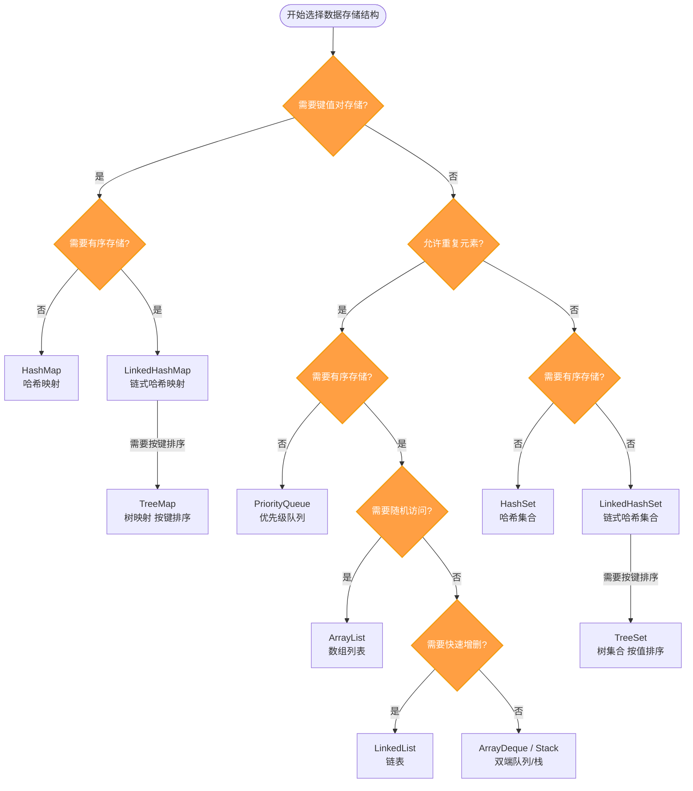

# 数据存储结构决策树

## 决策流程图

## 决策维度说明

| 决策维度 | 说明 |
|---------|------|
| 键值对存储 | 是否需要通过 Key-Value 形式存储数据 |
| 允许重复 | 集合中是否允许存在重复元素 |
| 有序存储 | 是否需要保持插入顺序或按自然排序 |
| 随机访问 | 是否需要通过索引快速访问任意位置元素 |
| 快速增删 | 是否需要在列表头部/尾部频繁进行增删操作 |

## 数据结构特性速查

| 数据结构 | 时间复杂度 | 特点 | 适用场景 |
|---------|-----------|------|---------|
| **HashMap** | O(1) 增删查 | 无序，键唯一 | 快速查找、缓存 |
| **LinkedHashMap** | O(1) 增删查 | 保持插入顺序 | 需要顺序遍历的映射 |
| **TreeMap** | O(log n) 增删查 | 按键排序，有序 | 范围查询、有序遍历 |
| **HashSet** | O(1) 增删查 | 无序，元素唯一 | 去重、快速查找 |
| **LinkedHashSet** | O(1) 增删查 | 保持插入顺序 | 需要顺序的去重集合 |
| **TreeSet** | O(log n) 增删查 | 按值排序，有序 | 有序集合、范围查询 |
| **ArrayList** | O(1) 访问，O(n) 增删 | 动态数组 | 频繁随机访问 |
| **LinkedList** | O(n) 访问，O(1) 头尾增删 | 双向链表 | 频繁头尾增删 |
| **ArrayDeque** | O(1) 头尾增删 | 双端队列 | 栈、队列操作 |
| **PriorityQueue** | O(log n) 增删，O(1) 查 | 堆实现 | 优先级处理、TopK |

### 复杂度对照表

| 操作 | HashMap/HashSet | TreeMap/TreeSet | ArrayList | LinkedList |
|-----|-----------------|-----------------|-----------|------------|
| 添加 | O(1) | O(log n) | O(1)* | O(1) |
| 删除 | O(1) | O(log n) | O(n) | O(1)* |
| 查找 | O(1) | O(log n) | O(n) | O(n) |
| 访问 | - | - | O(1) | O(n) |

> 注：ArrayList 添加均摊 O(1)，LinkedList 头尾删除 O(1)，指定位置删除 O(n)

### 数据结构详解

#### Map 系列（键值对存储）

| 数据结构 | 描述 |
|---------|------|
| **HashMap** | 基于哈希表实现，通过 key 的 hash 值定位存储位置。线程不安全，允许 null 键和值。查找效率最高，但不保证顺序。 |
| **LinkedHashMap** | 继承 HashMap，使用双向链表维护插入顺序或访问顺序（LRU）。性能略低于 HashMap，但需要顺序时首选。 |
| **TreeMap** | 基于红黑树实现，按键的自然顺序或自定义比较器排序。支持范围查询（如 `subMap`），性能 O(log n)。 |

#### Set 系列（唯一元素集合）

| 数据结构 | 描述 |
|---------|------|
| **HashSet** | 内部使用 HashMap 实现，只存储 key 不存储 value。去重最快，但无序。 |
| **LinkedHashSet** | 继承 HashSet，使用链表维护插入顺序。去重且需要保持顺序时使用。 |
| **TreeSet** | 基于 TreeMap 实现，元素按自然顺序或比较器排序。支持有序操作，但插入/删除稍慢。 |

#### List 系列（有序可重复集合）

| 数据结构 | 描述 |
|---------|------|
| **ArrayList** | 基于动态数组实现，连续内存存储。随机访问快，但中间插入/删除需要移动元素。适合读多写少场景。 |
| **LinkedList** | 双向链表实现，每个节点存前后指针。头尾操作快，但随机访问慢。可用作队列或栈。 |

#### 队列与特殊结构

| 数据结构 | 描述 |
|---------|------|
| **ArrayDeque** | 基于可变数组实现的双端队列，比 LinkedList/Stack 性能更好。推荐用作栈或队列的实现。 |
| **PriorityQueue** | 基于二叉小顶堆实现，元素按优先级排序。队头总是最小元素，适合任务调度、TopK 问题。 |

