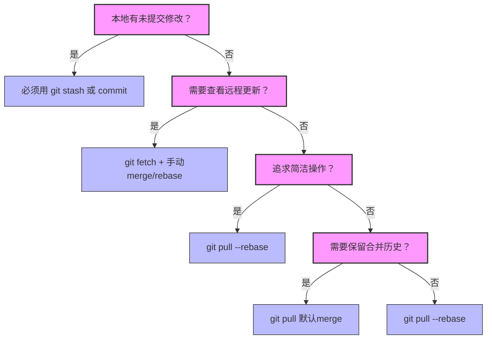
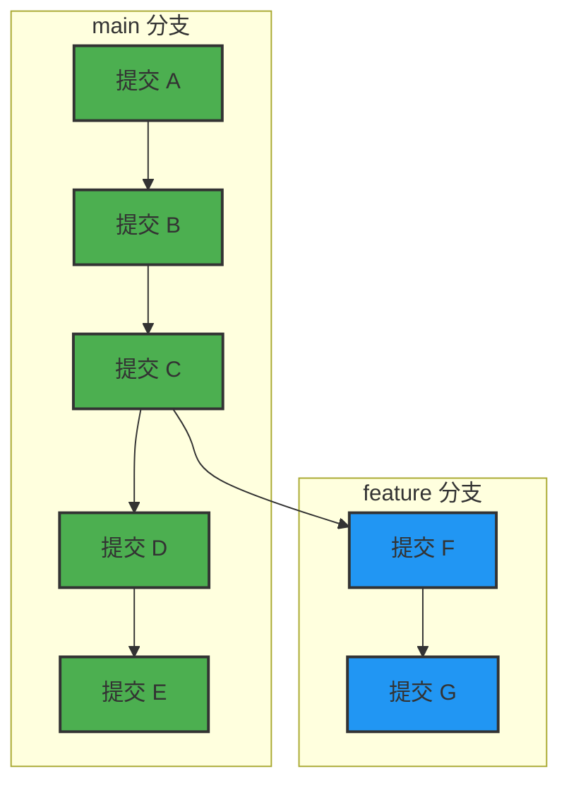
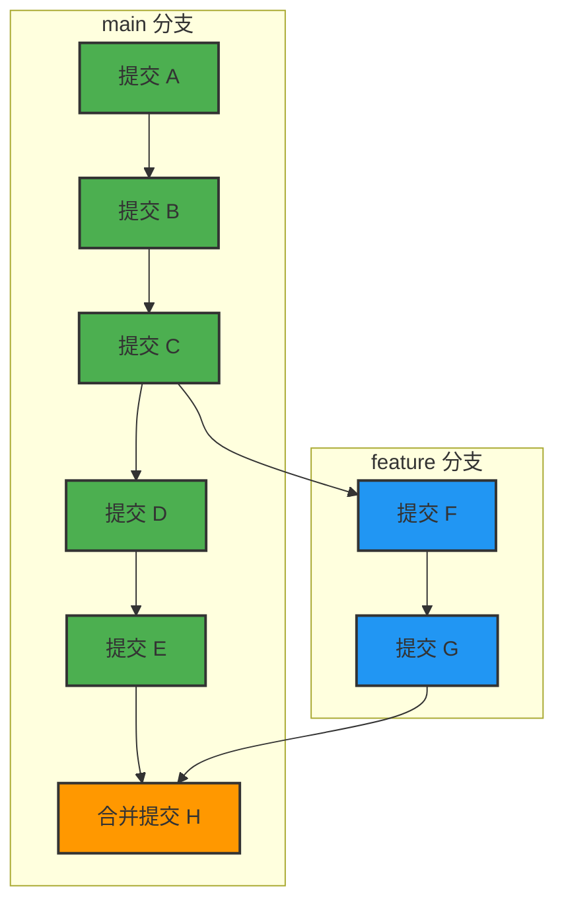
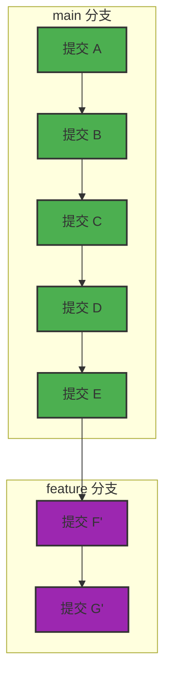

# GitFlow 分支管理模型

## 一、什么是 GitFlow？
GitFlow 是一种成熟的 Git 分支管理策略,用于规范团队协作中的代码版本管理流程。
- [GitFlow 官方文档](https://nvie.com/posts/a-successful-git-branching-model/)

## 二、核心分支概念
GitFlow 模型包含五大核心分支，每个分支都有明确的职责和使用场景：

### 1. Master 分支（主分支）
- **用途**：存放稳定的生产代码
- **特性**：始终保持可部署的稳定状态
- **管理**：只接受来自 Release 分支或 Hotfix 分支的合并
- **版本标记**：每个提交都应该添加版本标签（如 v1.0.0）

### 2. Develop 分支（开发分支）
- **用途**：集成所有正在开发的功能
- **来源**：基于 Master 分支创建
- **特性**：包含下一个版本要发布的所有功能
- **管理**：所有 Feature 分支开发完成后都合并到 Develop 分支

### 3. Feature 分支（功能分支）
- **用途**：开发新功能或改进
- **来源**：基于 Develop 分支创建
- **命名规范**：`feature/功能名称`（如 `feature/user-authentication`）
- **管理**：
  - 功能开发完成后合并回 Develop 分支
  - 永远不会直接与 Master 分支交互
  - push到远程仓库,发起 Pull Request/Merge Request 请求合并回 Develop 分支
  - 经过 Code Review（代码审核）通过后方可合并
### 4. Release 分支（发布分支）
- **用途**：准备新版本发布
- **来源**：基于 Develop 分支创建
- **命名规范**：`release/x.y.z`（如 `release/1.2.0`，x.y.z为版本号）
- **管理**：
  - 用于修复发布前的 bug
  - 不添加新功能，只处理 bug 修复和版本准备
  - 测试通过后同时合并回 Master 分支和 Develop 分支
  - 合并到 Master 分支后需要打版本标签
  - 发布完成后应及时删除

### 5. Hotfix 分支（热修复分支）
- **用途**：紧急修复生产环境中的问题
- **来源**：基于 Master 分支创建
- **命名规范**：`hotfix/x.y.z`（如 `hotfix/1.2.1`，x.y.z 为版本号）
- **管理**：
  - 仅用于紧急修复，不处理新功能
  - 修复完成后同时合并回 Master 分支和 Develop 分支
  - 合并到 Master 分支后需要打版本标签
  - 修复完成后立即删除
### 初始化仓库
```bash
# 1. 初始化本地仓库
git init

# 2. 添加远程仓库连接
git remote add origin <远程仓库URL>

# 3. 创建 Master 分支的首次提交
git add .
git commit --allow-empty -m "Initial commit"

# 4. 创建 Develop 分支
git checkout -b develop

# 5. 推送两个核心分支到远程
git push -u origin master
git push -u origin develop

# 6. 设置远程仓库的默认分支（可选但推荐）
git remote set-head origin master
```
> --allow-empty 允许创建空提交
## 三、工作流程示例
> 展示适用于单人开发或无 PR 强制要求的场景流程示例
> **标准的现代流程为：推送功能分支到远程 -> 在平台上创建 PR -> 审核通过后在网页端点击合并。**

### 1. 功能开发流程
1. 从 Develop 分支创建 Feature 分支
```bash
# 切换到 Develop 分支并确保是最新状态
git checkout develop
git pull origin develop

git checkout -b feature/xxx develop
```
2. 在 Feature 分支上进行功能开发
3. 开发完成后，将 Feature 分支合并回 Develop 分支
```bash
git checkout develop
# 采用--no-ff参数，表示强制创建合并提交
# 合并时会创建一个新的合并提交，保留分支历史
git merge --no-ff feature/xxx
git push
```
4. 删除本地 Feature 分支
```bash
git branch -d feature/xxx
# 如果之前推送了 Feature 分支，则需要删除远程分支
# git push origin --delete feature/xxx
```
### 2. 版本发布流程
1. 从 Develop 分支创建 Release 分支
```bash
# 切换到 Develop 分支并确保是最新状态
git checkout develop
git pull origin develop

git checkout -b release/x.y.z develop
```
2. 在 Release 分支上进行 bug 修复和版本准备
3. 测试通过后，将 Release 分支合并回 Master 分支并打版本标签
```bash
git checkout master
git merge --no-ff release/x.y.z
git tag -a tagName -m "Release x.y.z"
# 推送标签到远程仓库
git push origin tagName
# 推送代码到远程仓库
git push 
```
4. 同时将 Release 分支合并回 Develop 分支，确保开发分支包含所有修复
```bash
git checkout develop
git merge --no-ff release/x.y.z
git push
```
5. 删除 Release 分支
```bash
git branch -d release/x.y.z
# 如果之前推送了 Release 分支，则需要删除远程分支
# git push origin --delete release/x.y.z
```

### 3. 热修复流程
1. 从 Master 分支创建 Hotfix 分支
```bash
# 切换到 Master 分支并确保是最新状态
git checkout master
git pull origin master

git checkout -b hotfix/x.y.z master
```
2. 在 Hotfix 分支上修复问题
3. 测试通过后，将 Hotfix 分支合并回 Master 分支并打版本标签
```bash
git checkout master
git merge --no-ff hotfix/x.y.z
git tag -a tagName -m "Hotfix x.y.z"
# 推送标签到远程仓库
git push origin tagName
# 推送代码到远程仓库
git push 
```
4. 同时将 Hotfix 分支合并回 Develop 分支，确保开发分支包含修复
```bash
git checkout develop
git merge --no-ff hotfix/x.y.z
git push
```
5. 删除 Hotfix 分支
```bash
git branch -d hotfix/x.y.z
# 如果之前推送了 Hotfix 分支，则需要删除远程分支
# git push origin --delete hotfix/x.y.z
```
## 四、Git回退操作
### 有改动,无add,无commit
> 撤销工作区改动
`git checkout -- filename`
### 有改动,有add,无commit
> 撤销暂存区的改动
`git reset HEAD filename`
### 有改动,有add,有commit
> 从本地库回退（已commit，未push）

| 操作描述 | 命令 | 效果 |
| :-: | :-: | :-: |  
| 撤销提交，但保留改动在工作区 |	git reset --mixed HEAD^ |	提交消失，改动还在工作区 |  
| 撤销提交，但保留改动在暂存区 |	git reset --soft HEAD^	| 提交消失，改动还在暂存区 |   
| 彻底丢弃（真的不要了）|	git reset --hard HEAD^ |	全部消失，慎用！ |
### 有改动,有add,有commit,有push
> 撤销已推送的提交   
> 创建一个新提交，用于撤销指定提交    
> 提交的新提交用来"抵消"（逆向操作）指定提交的更改。  
> revert后需要再次 git push 才能同步到远程  

`git revert <commit-hash>`
### reset VS revert

| 操作 | 描述 | 影响 |
| :-: | :-: | :-: |  
| reset | 通过移动分支指针来回退到指定提交 | 直接改变历史 |  
| revert | 创建一个新提交，用于来"抵消"（逆向操作）指定提交的更改 | 不改变历史,而是在历史记录中增加一个新的,反向的提交 |  

## 五、Git Stash（暂存区域）
> 临时保存工作进度，快速切换上下文，而不需要创建临时提交。

### 紧急修复bug时的上下文切换
```bash
# 正在功能分支开发，突然需要修复生产bug
$ git status
# 修改：src/feature.js
# 修改：src/feature.css

# 最佳实践：使用描述性消息
$ git stash push -m "WIP: 用户头像上传功能开发中"

# 切换到主分支修复bug
$ git checkout main
$ git pull origin main
$ git checkout -b hotfix/login-bug
# ... 修复工作 ...

# 返回后继续开发
$ git checkout feature/user-avatar
$ git stash list
# stash@{0}: WIP: 用户头像上传功能开发中

$ git stash pop
# 恢复工作进度
```
> 默认情况下，git stash 只能暂存已跟踪文件（tracked files）的修改，但可以通过参数`-u`显式包含未跟踪文件。  
```bash
git stash push -u -m "描述"
```
- 始终使用 -m 添加描述性消息
- git stash apply（仅恢复）
- git stash pop（恢复并删除）
- 定期清理过期的 stash：git stash drop stash@{0}
- git stash clear（清空所有 stash）
- 可以跨分支使用 stash

## 六、Git Cherry-Pick
> 将特定提交从一个分支复制到另一个分支，而不合并整个分支历史。
- 涉及单个提交
```bash
git cherry-pick -x <commit-hash>
```
> -x 参数表示在提交信息中添加"cherry picked from commit"说明
- 涉及多个提交
```bash
git cherry-pick -x <commit-hash1>..<commit-hash2> # 不包含起始提交
git cherry-pick -x <commit-hash1>^..<commit-hash2> # 包含起始提交
```
- 冲突处理
-  git cherry-pick --continue  # 继续完成cherry-pick
- git cherry-pick --abort  # 撤销并回到初始状态

## 七、Git Fetch & Git Pull
### fetch VS pull
| 操作 | 本质 | 对本地代码的影响 |
| :-: | :-: | :-: |  
| fetch | 仅下载远程更新 | 不改变工作目录和当前分支 |  
| pull | 下载+自动合并(git fetch + git merge 的自动执行) | 改变工作目录和当前分支 |  
### 决策树


- 默认 git pull = git fetch + git merge (产生合并提交)
- git pull --rebase = git fetch + git rebase (历史变平)
> git pull --rebase   
> 获取远程更新,将本地提交"嫁接"到远程最新提交之上
## 八、Git Merge & Git Rebase
### merge VS rebase
| 操作 | 本质 | 对本地代码的影响 | 应用 | 描述 |
| :-: | :-: | :-: | :--:| :--: |
| merge | 合并两个分支 | 改变工作目录和当前分支 | 在「接收合并的目标分支」上执行 |站在目标分支，合并进来 |
| rebase | 将指定分支的提交历史，应用到当前分支 | 改变工作目录和当前分支 | 在「被变基的分支」上执行 | 站在被变基分支，基于基准变 |
> ⚠️ 黄金法则：**永远不要对位于公共仓库之外的提交（即已经 push 到远程并被他人使用的提交）执行 Rebase。**  
> 只对尚未推送或仅属于你个人的本地提交使用 Rebase。对公共历史 Rebase 会导致团队成员协作时产生混乱和代码丢失。
### 可视化对比
**分支初始状态**


#### Git Merge 可视化
`git checkout main`  
`git merge feature`后状态

- main 分支：指针移到新的合并提交 H，历史新增合并记录；
- feature 分支：指针位置不变（仍指向 G），分支本身毫发无损；
#### Git Rebase 可视化
`git checkout feature`  
`git rebase main`后状态

- main 分支：完全不受影响，指针仍指向 E；
- feature 分支：指针从原来的 G 移到新的 G'（提交历史被重写）


## 附录
- 缺少 CI/CD 配置