# Mermaid

> [Mermaid](https://mermaid.nodejs.cn/)    
> 用文本语法生成图表，GitHub / GitLab / Obsidian 原生支持。

## 一、流程图（Flowchart）

### 1.1 方向

| 关键字 | 方向 |
|:-------|:-----|
| `TD` / `TB` | 上 → 下 |
| `LR` | 左 → 右 |
| `BT` | 下 → 上 |
| `RL` | 右 → 左 |

### 1.2 节点形状

| 语法 | 形状 |
|:-----|:-----|
| `A[文本]` | 矩形 |
| `A(文本)` | 圆角矩形 |
| `A{文本}` | 菱形（判断） |
| `A((文本))` | 圆形 |
| `A{{文本}}` | 六边形 |
| `A[/文本/]` | 平行四边形 |
| `A[\文本\]` | 梯形 |
| `A[(文本)]` | 圆柱（数据库） |

### 1.3 箭头类型

| 语法 | 说明 |
|:-----|:-----|
| `-->` | 实线箭头 |
| `-.->` | 虚线箭头 |
| `==>` | 粗线箭头 |
| `---` | 实线（无箭头） |
| `-->\|标签\|` | 带标签的箭头 |
| `-- 文字 -->` | 标签的另一种写法 |

### 1.4 子图（Subgraph）

用 `subgraph` 将相关节点分组：

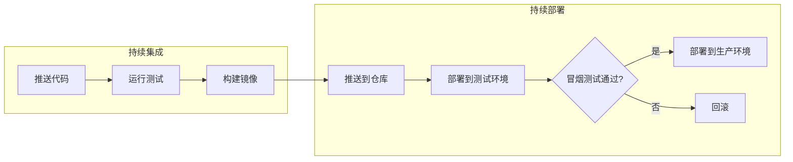

## 二、时序图（Sequence Diagram）

> 展示组件间随时间的通信过程，纵轴为时间（向下流动）。

### 2.1 参与者

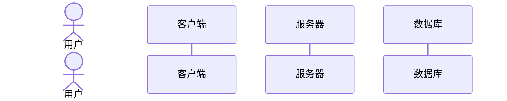

- `actor` 显示为人形图标
- `participant` 显示为系统方框
- `as` 关键字设置别名

### 2.2 消息类型

| 语法 | 说明 |
|:-----|:-----|
| `->` | 实线（同步） |
| `-->` | 虚线（返回/响应） |
| `->>` | 实线箭头（异步请求） |
| `-->>` | 虚线箭头（异步响应） |
| `-x` | 实线叉号（丢失消息） |

### 2.3 激活条

显示参与者何时在处理请求：

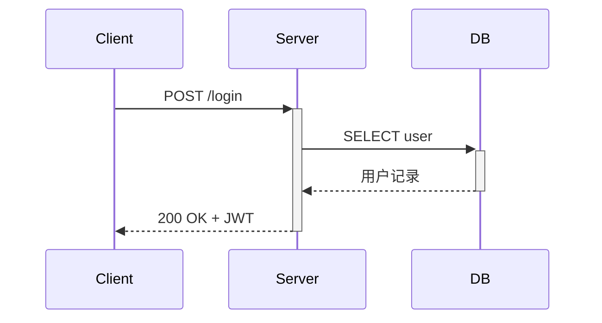

- `+` 加在箭头末尾：激活**接收方**，显示激活条（开始处理）
- `-` 加在箭头末尾：关闭**发送方**的激活条（处理完毕）

> 上例中：`Client->>+Server` 激活 Server；`DB-->>-Server` 关闭 DB 的激活条；`Server-->>-Client` 关闭 Server 的激活条

### 2.4 控制流

| 语法 | 用途 | 
|:-----|:-----|
| `alt` / `else` | 条件分支 | 
| `opt` | 可选交互 | 
| `loop` | 循环 | 
| `par` / `and` | 并行执行 | 

> 所有控制流块都必须用 `end` 关闭。

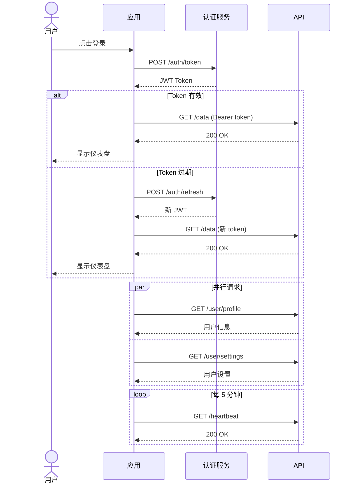

### 2.5 注释

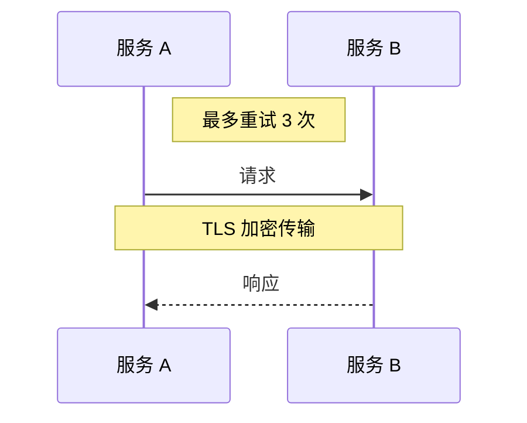

- `Note right of` / `Note left of` — 附在参与者一侧
- `Note over A,B` — 跨参与者显示

## 三、类图（Class Diagram）

> 展示面向对象系统的类结构、属性、方法及类之间的关系。

### 3.1 可见性标记

| 标记 | 访问级别 |
|:-----|:---------|
| `+` | public |
| `-` | private |
| `#` | protected |
| `~` | package / internal |

### 3.2 类定义

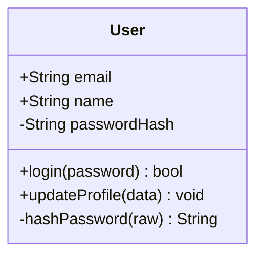

### 3.3 类之间的关系

**连线类型：**

| 符号 | 线型 |
|:-----|:-----|
| `--` | 实线 |
| `..` | 虚线 |

**端点符号：**

| 符号 | 样式 | 含义 |
|:-----|:-----|:-----|
| `<` / `>` | 箭头 | 指向 |
| `<\|` / `\|>` | 三角 | 继承/实现 |
| `*` | 实心菱形 | 组合 |
| `o` | 空心菱形 | 聚合 |

> 端点符号可写在连线 `--` / `..` 的**任意一侧**，方向由书写位置决定。例如 `--|>` 和 `<|--` 都是继承，仅方向不同。

**常用组合：**

| 语法 | 关系 | 说明 |
|:-----|:-----|:-----|
| `<\|--` | 继承 | extends |
| `*--` | 组合 | 生命周期依赖（ owns ） |
| `o--` | 聚合 | 独立生命周期（ has ） |
| `-->` | 关联 | uses |
| `..>` | 依赖 | depends on |
| `..\|>` | 实现 | implements interface |

### 3.4 注解

用 `<<interface>>` 或 `<<abstract>>` 标注类的类型：

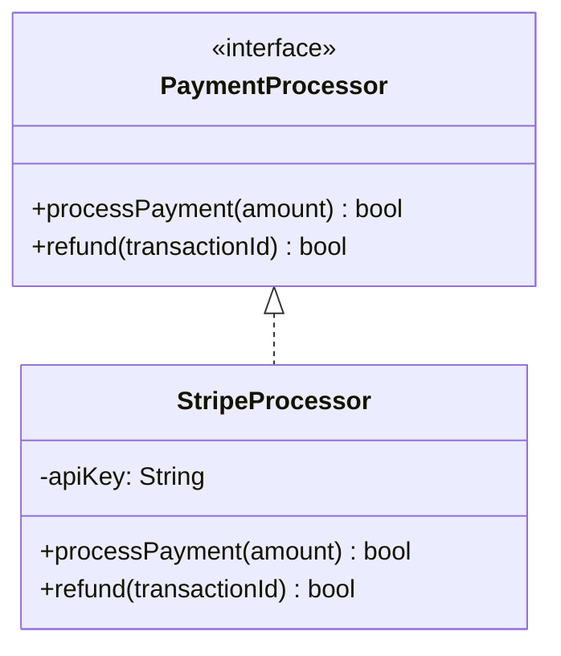

### 3.5 多重性标签

在关系连线上用 `"标签"` 标注两端的数量关系：

```
类A "1" --> "*" 类B : 描述
```

| 标签 | 含义 |
|:-----|:-----|
| `"1"` | 恰好一个 |
| `"0..1"` | 零或一个 |
| `"*"` | 零或多个 |
| `"1..*"` | 一个或多个 |

> 标签写在类名与连线语法之间，第一个标签属于左边的类，第二个属于右边的类。

### 3.6 完整示例：电商领域模型

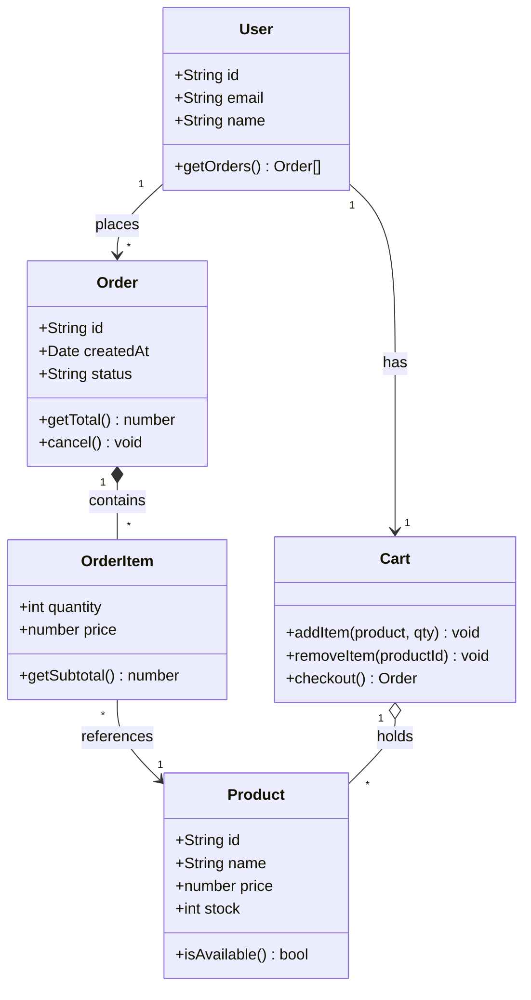

## 四、实体关系图（ER Diagram）

> 建模数据库表结构，展示实体、属性及表间关系。与 SQL 表设计一一对应。

### 4.1 实体与属性

`PK` 标记主键，`FK` 标记外键，`UK` 标记唯一约束：

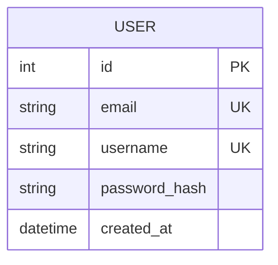

### 4.2 关系基数

| 语法 | 含义 |
|:-----|:-----|
| `\|\|--\|\|` | 一对一 |
| `\|\|--o{` | 一对零或多 |
| `\|\|--\|{` | 一对一或多 |
| `}o--o{` | 零或多对零或多 |

> 符号拆解：`|` 恰好一个，`o` 零个，`{` 多个。从左往右读。

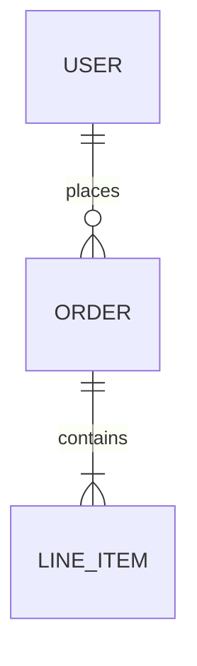

### 4.3 完整示例：博客平台

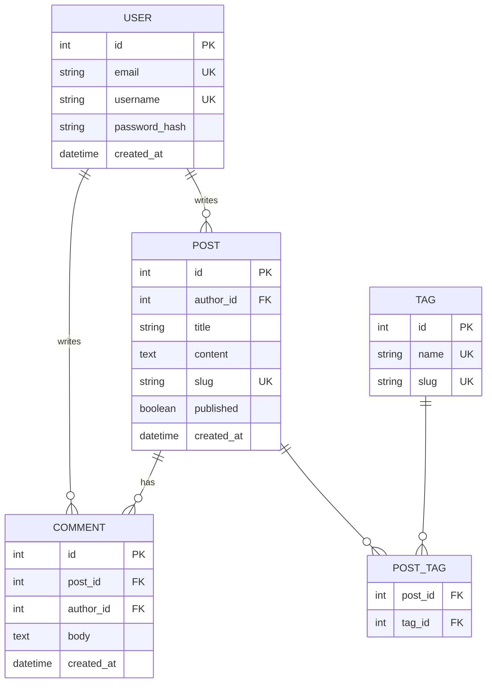

## 五、甘特图（Gantt Chart）

> 可视化项目时间线，展示任务、工期、依赖和里程碑。

### 5.1 基本结构

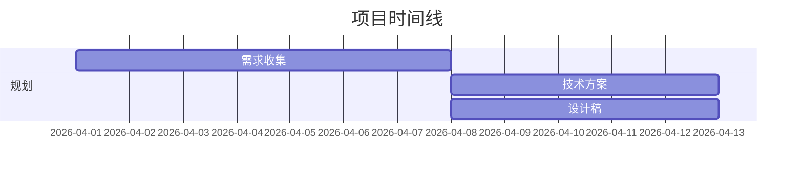

- 每个任务可指定 `ID`（如 `a1`），供其他任务用 `after` 引用建立依赖
- 日期格式通过 `dateFormat` 指定，工期用 `Nd`（天）

### 5.2 任务状态与里程碑

| 关键字 | 效果 |
|:-------|:-----|
| `done` | 已完成（实心填充） |
| `active` | 进行中（高亮） |
| `crit` | 关键路径（红色） |
| `milestone` | 里程碑（零工期标记） |

> 状态关键字写在任务 ID 之前，逗号分隔。

### 5.3 完整示例：产品上线

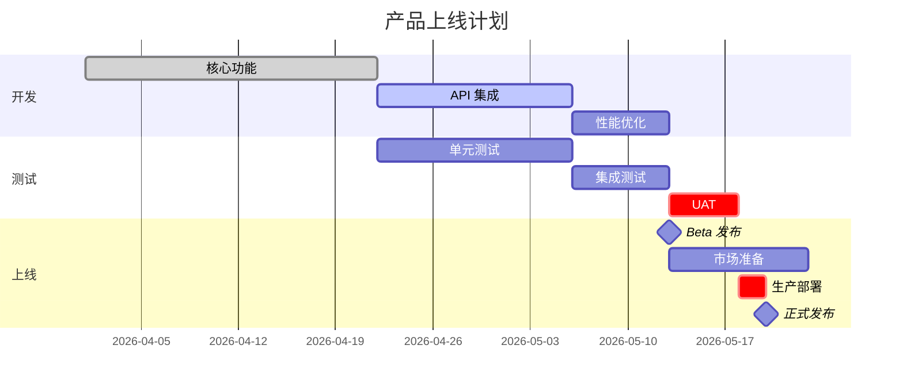

## 六、思维导图（Mind Map）

> 用于头脑风暴和层级化的想法整理，基于**缩进**定义层级关系。

### 6.1 基本语法

- 根节点使用 `((双圆括号))` 显示为圆形
- 子节点通过缩进定义层级
- 节点支持与[流程图](#12-节点形状)相同的形状语法：`[矩形]`、`(圆角)`、`{菱形}`、`{{六边形}}`

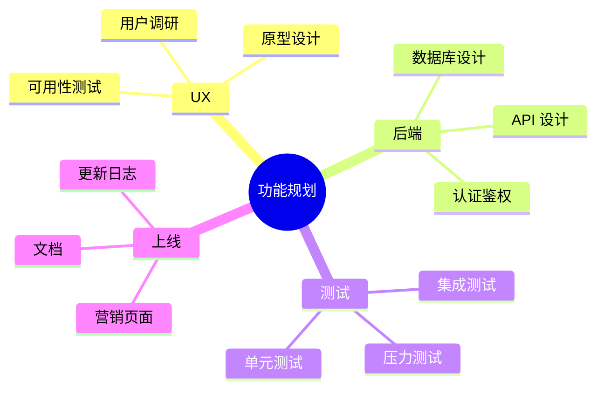

> 思维导图适合高层级规划和头脑风暴。如需箭头或流程方向，请使用流程图。
